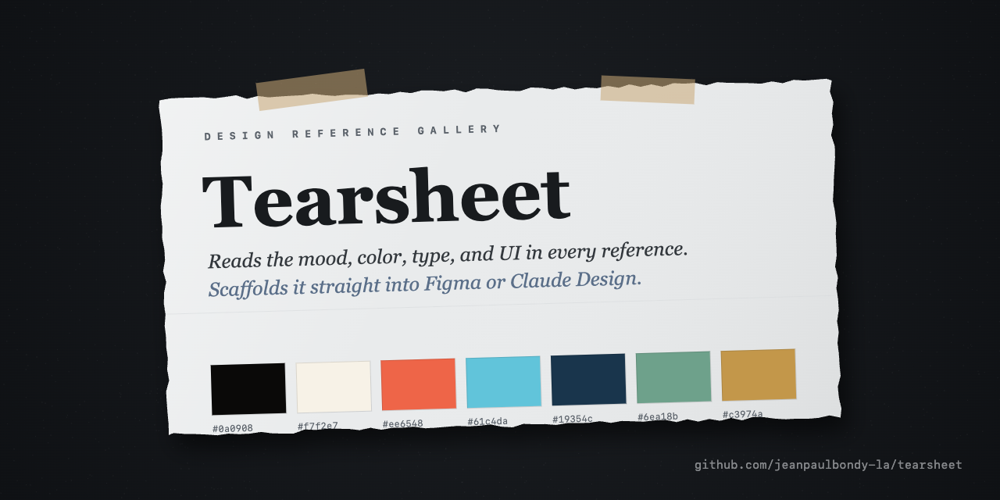
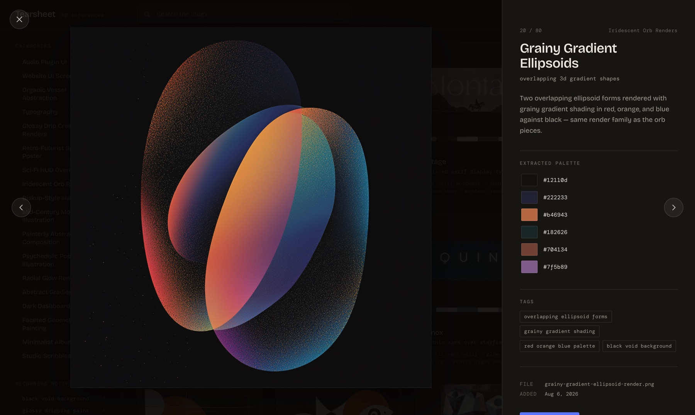

<p align="center">
  
</p>

# Tearsheet

A personal, visual reference gallery that runs on your machine. Drop in images or videos and Claude Code catalogs them, reading each one for its mood, color, type, and UI and extracting a real color palette from the pixels. Browse them as an index, pull a selection into any project as design context, or scaffold the mood, typography, and UI patterns straight into a new Figma file or Claude Design project.

Everything stays local. Nothing is uploaded anywhere unless you explicitly push it.

## Install

```bash
git clone https://github.com/jeanpaulbondy-la/tearsheet.git
```

```bash
cd tearsheet && npm install && npm run setup
```

`npm run setup` does two things:

- Installs the global commands (`/use-tearsheet`, `/tearsheet-to-figma`, `/tearsheet-to-design`) into `~/.claude/skills/`. Restart Claude Code once so it picks them up.
- On macOS, builds **Tearsheet.app** in the project folder. Drag it onto the Dock; clicking it starts the server if needed and opens the gallery. The first launch may ask you to confirm opening an app from an unidentified developer (right-click, Open).

<p>
  
</p>

You can also run it by hand from the project folder:

```bash
npm start
```

Then open **http://localhost:4560**. The gallery starts empty.

## Use

**Add references**

1. Drop image files (`.png`, `.jpg`, `.jpeg`, `.webp`, `.gif`) or video files (`.mp4`, `.mov`, `.webm`, `.m4v`) into the `inbox/` folder.
2. In Claude Code, inside the `tearsheet` folder, run `/process-inbox`. It renames, tags, describes, and catalogs each file, and extracts a real color palette from it. Videos get a representative frame pulled (via a bundled ffmpeg, no separate install) for the palette and thumbnail; cards preview the video on hover.

**Browse**

Reload `localhost:4560`. The index rail on the left lists every category with its count, plus the recurring motifs (tags shared by two or more references). Filters are multi-select; click an active one to clear it. Press `/` to search titles, tags, categories, and descriptions.

Click any image to open it full size with its description, the extracted palette (click a hex value to copy it), and its tags. The arrow keys move through the current result set and `Esc` closes. Every reference has a link of its own (`localhost:4560/#ref=<id>`) that opens straight to this view.

<p align="center">
  
</p>

**Use a selection in another project**

1. Hover a card and click its checkbox to select it (or use the button in the detail view), then **Save for Claude Code**.
2. In Claude Code, in *any* project, run `/use-tearsheet`. Claude pulls in the selected references as design context.

**Or turn a selection into a design-tool starter kit**

Same selection step, then in Claude Code run `/tearsheet-to-figma` (new Figma file) or `/tearsheet-to-design` (new claude.ai/design project). The skill automatically finds your saved selection, builds color tokens and type styles from the extracted palettes, and creates a small starter kit of UI components if any images look like real interfaces.

### The complete workflow (end-to-end)

```
1. Drop images into inbox/
   ↓
2. Run /process-inbox (indexes + extracts palettes)
   ↓
3. Browse at http://localhost:4560
   ↓
4. Select images → "Save for Figma"
   ↓
5. Run /tearsheet-to-figma in Claude Code
   ↓
6. One approval gate → Figma file ready in seconds
```

**Why this is frictionless:**
- Selection is automatic (no "use this or start fresh?" prompts)
- Figma team is cached (no "which team?" questions unless ambiguous)
- One comprehensive operation (not 31 separate API calls = not 31 approval gates)
- Result: your design tokens + components in Figma, seconds after hitting enter

See `skills/tearsheet-to-figma/SKILL.md` for implementation details.

## Structure

- `inbox/`: drop zone for new, unprocessed images and videos
- `images/`: processed, renamed images (git-ignored, this is your personal library)
- `data/gallery.json`: metadata for every item, including its extracted palette (git-ignored)
- `public/`: the gallery site (static HTML, CSS, JS; self-hosted type, no external requests)
- `server.js`: serves the site and handles saving selections
- `scripts/setup.js`: installs the global commands and builds the macOS launcher
- `scripts/palette.js`, `scripts/video-thumbnail.js`: palette extraction and video frame capture used by `/process-inbox`
- `.claude/skills/process-inbox/`: the `/process-inbox` command (project-scoped, auto-loaded)
- `skills/use-tearsheet/`, `skills/tearsheet-to-figma/`, `skills/tearsheet-to-design/`: the global commands installed by `npm run setup`
- `assets/`: app icon, social preview card, and README images

## License

MIT. Type is Bricolage Grotesque and DM Mono, both under the SIL Open Font License (see `public/fonts/LICENSE.txt`).
