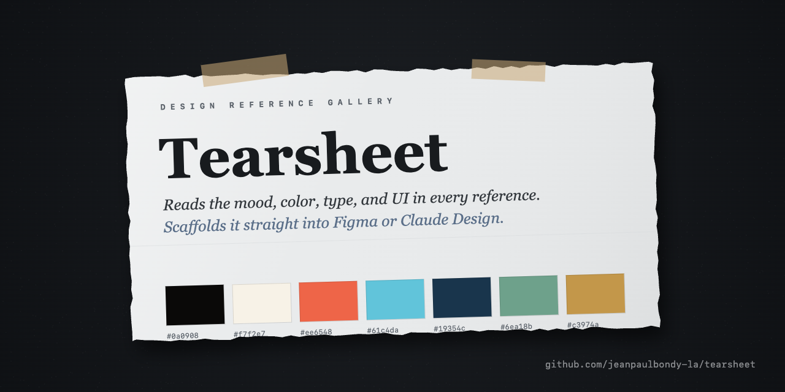
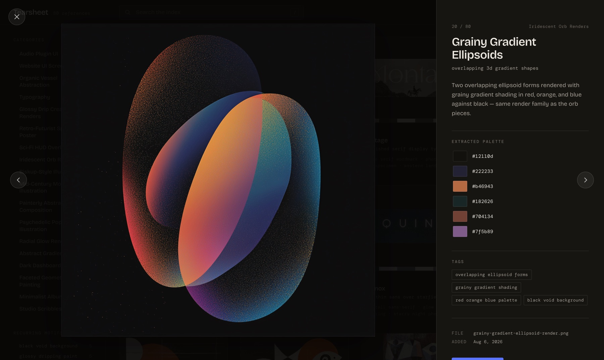

<p align="center">
  
</p>

# Tearsheet

A personal, visual reference gallery that runs on your machine. Drop in images or videos and Claude Code catalogs them, reading each one for its mood, color, type, and UI and extracting a real color palette from the pixels. Browse them as an index, pull a selection into any project as design context, or scaffold the mood, typography, and UI patterns straight into a new Figma file or Claude Design project.

Everything stays local. Nothing is uploaded anywhere unless you explicitly push it.

## Install

```bash
git clone https://github.com/jeanpaulbondy-la/tearsheet.git
cd tearsheet
npm install && npm run setup
```

**Then set up Figma integration:**

1. Get your Anthropic API key from [console.anthropic.com](https://console.anthropic.com)
2. Copy `.env.example` to `.env`
3. Add your key: `ANTHROPIC_API_KEY=sk-ant-...`

`npm run setup` installs the global Claude Code commands (`/use-tearsheet`, `/tearsheet-to-figma`, `/tearsheet-to-design`) into `~/.claude/skills/`. On macOS, it also builds **Tearsheet.app** — drag it onto the Dock to start the server and open the gallery from your menu bar.

<p>
  
</p>

You can also run it by hand from the project folder:

```bash
npm start
```

Then open **http://localhost:4560**. The gallery starts empty.

## Use

**Add references**

1. Drop image files (`.png`, `.jpg`, `.jpeg`, `.webp`, `.gif`) or video files (`.mp4`, `.mov`, `.webm`, `.m4v`) into the `inbox/` folder.
2. Start or refresh the server (`npm start`). Tearsheet auto-processes new files in the background on startup — renames them, extracts color palettes, guesses categories, and catalogs them. No prompts, no permission gates.

**Two processing modes:**

- **Auto mode (default):** On startup, the server scans `inbox/`, generates sensible defaults (filename → title, palette extraction, category guessing), and adds items to the gallery silently. Fast, frictionless, zero interaction.
- **Manual mode (high quality):** In Claude Code, run `/process-inbox` to have Claude review each image, write custom tags and descriptions, and decide metadata. Better for images you want polished documentation on. Can be run anytime to refine existing gallery entries.

**Browse**

Reload `localhost:4560`. The index rail on the left lists every category with its count, plus the recurring motifs (tags shared by two or more references). Filters are multi-select; click an active one to clear it. Press `/` to search titles, tags, categories, and descriptions.

Click any image to open it full size with its description, the extracted palette (click a hex value to copy it), and its tags. The arrow keys move through the current result set and `Esc` closes. Every reference has a link of its own (`localhost:4560/#ref=<id>`) that opens straight to this view.

<p align="center">
  
</p>

**Use a selection in another project**

1. Hover a card and click its checkbox to select it (or use the button in the detail view), then **Save for Claude Code**.
2. In Claude Code, in *any* project, run `/use-tearsheet`. Claude pulls in the selected references as design context.

**Or turn a selection into a design-tool starter kit**

Same selection step, then click "Build File" in Tearsheet. It creates a Figma file with color tokens, type styles, and UI components — all automatically, using your Anthropic API key.

### The complete workflow

**Fast path (default):**

```
1. Drop images into inbox/
   ↓
2. npm start (auto-processes in background, silent)
   ↓
3. Browse at http://localhost:4560
   ↓
4. Select images → Click "Build File"
   ↓
5. Figma file appears in seconds (browser opens it automatically)
```

**Refined path (when you want custom metadata):**

```
1. Drop images into inbox/
   ↓
2. npm start (auto-processes with defaults)
   ↓
3. In Claude Code, run /process-inbox (Claude polishes metadata, tags, descriptions)
   ↓
4. Browse + Select → Click "Build File" (Figma inherits the refined data)
```

**One-click Figma creation:** Selection → Click → Done. No extra steps, no permission gates. Claude builds the entire file server-side using the Figma API.

**For even more control**, in Claude Code run `/tearsheet-to-figma` or `/tearsheet-to-design` (manual skill invocation gives you prompts and design options).

See `skills/tearsheet-to-figma/SKILL.md` for build details.

## Structure

- `inbox/`: drop zone for new, unprocessed images and videos
- `images/`: processed, renamed images (git-ignored, this is your personal library)
- `data/gallery.json`: metadata for every item, including its extracted palette (git-ignored)
- `public/`: the gallery site (static HTML, CSS, JS; self-hosted type, no external requests)
- `server.js`: serves the site and handles saving selections
- `scripts/setup.js`: installs the global commands and builds the macOS launcher
- `scripts/palette.js`, `scripts/video-thumbnail.js`: palette extraction and video frame capture used by `/process-inbox`
- `.claude/skills/process-inbox/`: the `/process-inbox` command (project-scoped, auto-loaded)
- `skills/use-tearsheet/`, `skills/tearsheet-to-figma/`, `skills/tearsheet-to-design/`: the global commands installed by `npm run setup`
- `assets/`: app icon, social preview card, and README images

## License

MIT. Type is Bricolage Grotesque and DM Mono, both under the SIL Open Font License (see `public/fonts/LICENSE.txt`).
